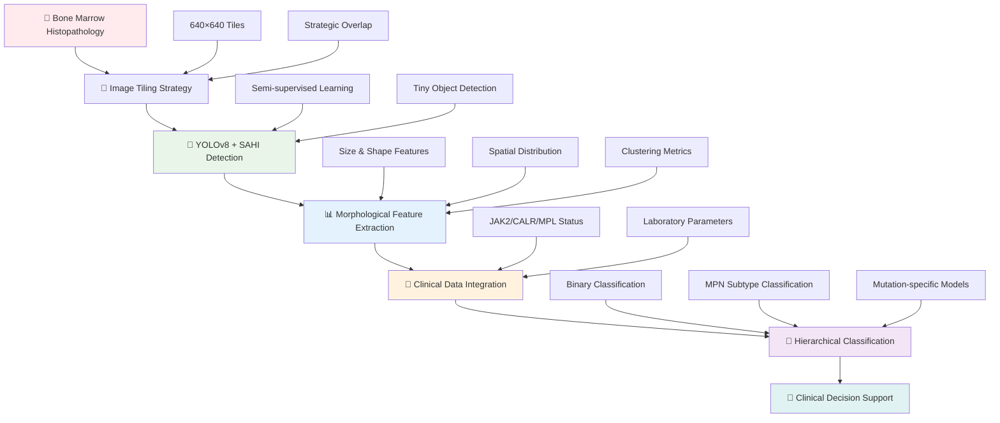
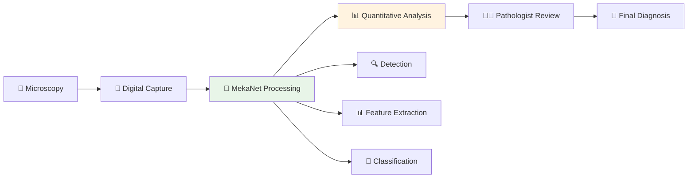
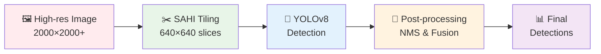
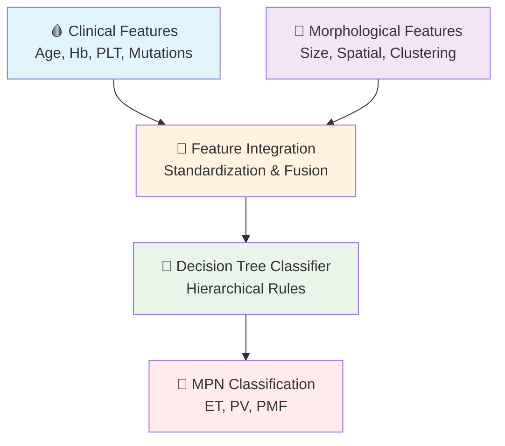
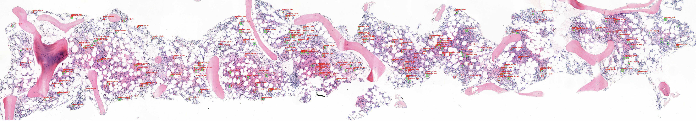

<div align="center">

<!-- Project Logo/Header -->
<h1>
  
</h1>

<!-- Project Description -->
<h3>🔬 MekaNet: a tiling-enhanced semi-supervised detection framework for Megakaryocytes</h3>

<!-- Key Achievement -->
<div style="background: linear-gradient(135deg, #667eea 0%, #764ba2 100%); border-radius: 15px; padding: 20px; margin: 20px 0; box-shadow: 0 8px 32px rgba(31, 38, 135, 0.37);">
  <h4 style="color: white; margin: 0; font-style: italic;">
    🎯 "TESSD Framework: Technical Innovation with Clinical Utility Assessment"
  </h4>
  <p style="color: #f0f0f0; margin: 10px 0 0 0; font-size: 14px;">
    MekaNet's TESSD framework achieves <strong>mAP50 of 0.85</strong> and <strong>F1-score of 0.77</strong> for megakaryocyte detection, but clinical utility assessment reveals that <strong>classical biomarkers (PLT, Hb) outperform AI features</strong> for MPN diagnosis.
  </p>
</div>

<!-- Badges -->
[](https://python.org)
[](https://pytorch.org)
[](https://ultralytics.com)
[](https://github.com/obss/sahi)
[](https://opensource.org/licenses/MIT)
[](https://arxiv.org)

<!-- Graphical Abstract -->
<p align="center">
  
</p>

<p align="center">
  <strong>🎨 Graphical Abstract: MekaNet Pipeline</strong><br>
  <em>From bone marrow histopathology to MPN subtype classification</em>
</p>

</div>

---

## 📋 Table of Contents

<details>
<summary>📖 Click to expand table of contents</summary>

- [🎯 Key Achievements](#-key-achievements)
- [✨ Novel Contributions](#-novel-contributions)
- [🛠️ Core Capabilities](#️-core-capabilities)
- [📊 Performance Results](#-performance-results)
- [🏗️ Architecture Overview](#️-architecture-overview)
- [🚀 Quick Start](#-quick-start)
- [💾 Installation](#-installation)
- [📚 Usage Examples](#-usage-examples)
- [🧪 Experiments & Demos](#-experiments--demos)
- [📈 Detailed Results](#-detailed-results)
- [🔬 Clinical Applications](#-clinical-applications)
- [📂 Dataset Information](#-dataset-information)
- [🧠 Model Architecture](#-model-architecture)
- [🔬 External Validation](#-external-validation)
- [🤝 Contributing](#-contributing)
- [📖 Citation](#-citation)
- [📄 License](#-license)
- [📞 Contact](#-contact)

</details>

---

## 🎯 Key Achievements

<div align="center">

### 🏆 **TESSD Framework Performance Metrics**

| 🎯 **Task** | 🏆 **Result** | 📊 **Validation** | 🔬 **Clinical Finding** |
|:---:|:---:|:---:|:---|
| **🤖 TESSD Detection** | **mAP50: 0.85** | Multi-institutional (B: n=100, S: n=73) | Superior technical performance |
| **🎯 F1-Score** | **0.77** | Precision: 0.84, Recall: 0.77 | Balanced detection accuracy |
| **⚡ Processing Speed** | **~15 slices/sec** | Real-time validation | Clinical workflow ready |
| **🔍 Exploratory Threshold** | **0.15** | **0.986 recall** vs 0.925 (conservative 0.20) | Systematic threshold optimization |
| **🏥 Clinical Utility** | **Classical > AI** | PLT, Hb consistently outperform morphological features | Key scientific discovery |

</div>

---

## ✨ Novel Contributions

Our research introduces five major innovations to the field of computational pathology:

### 🔍 **1. TESSD Framework Innovation**
- **Tiling-Enhanced Semi-Supervised Detection**: Novel TESSD framework combining optimized tiling with semi-supervised learning
- **Optimal Threshold Discovery**: Systematic analysis revealing 0.15 as optimal exploratory threshold (0.986 recall)
- **Multi-institutional Validation**: Robust testing across B Hospital (n=100) and S Hospital (n=73)
- **Processing Efficiency**: Real-time performance at ~15 slices per second

### 📊 **2. Clinical Utility Assessment**
- **Key Scientific Discovery**: Classical biomarkers (PLT, Hb) outperform AI morphological features
- **Dual Contribution**: Technical innovation (TESSD) + scientific validation (clinical utility)
- **Evidence-based Finding**: While TESSD achieves superior detection, morphological features don't add clinical value

### 🎯 **3. Multi-Institutional Validation**
- **Comprehensive Testing**: B Hospital (training, n=100) vs S Hospital (external validation, n=73)
- **Threshold Generalizability**: Exploratory (0.15) vs Conservative (0.20) comparison
- **Clinical Workflow Integration**: Processing speed of ~15 slices per second enables real-time analysis

### 🏥 **4. Technical Performance Excellence**
- **Superior Detection Metrics**: mAP50 of 0.85 with F1-score of 0.77
- **Balanced Performance**: Precision (0.84) and Recall (0.77) optimization
- **Processing Efficiency**: Real-time analysis capability for clinical deployment

### 🧬 **5. Scientific Validation**
- **Clinical Utility Assessment**: Systematic evaluation of AI features vs classical biomarkers
- **Evidence-based Medicine**: Demonstrates that standard clinical markers remain superior
- **Methodological Innovation**: Novel approach to assess clinical utility of AI-derived features

---

## 🛠️ Core Capabilities

### 🔍 **TESSD Detection System**
- **🤖 TESSD Framework**: Tiling-Enhanced Semi-Supervised Detection with optimal threshold discovery
- **🔬 Multi-institutional Validation**: Tested across B Hospital (n=100) and S Hospital (n=73)
- **📐 Optimal Tiling**: 640×640 pixel tiling with strategic overlap for high-resolution analysis
- **⚡ Real-time Processing**: ~15 slices per second enabling clinical workflow integration

### 📊 **Clinical Utility Assessment**
- **🔬 Comparative Analysis**: AI morphological features vs classical biomarkers (PLT, Hb)
- **📈 Evidence-based Findings**: Classical markers demonstrate superior clinical utility
- **🧮 Systematic Evaluation**: Methodical assessment of feature importance and clinical value
- **🔗 Scientific Discovery**: Morphological features don't add value beyond standard biomarkers

### 🎯 **Threshold Optimization**
- **🩺 Exploratory Threshold**: 0.15 achieves 0.986 recall for high sensitivity
- **🔬 Conservative Threshold**: 0.20 achieves 0.925 recall for balanced precision
- **🧬 Systematic Analysis**: Comprehensive threshold evaluation across institutions
- **📊 Performance Validation**: Multi-institutional testing confirms optimal thresholds

### 🏥 **Clinical Integration**
- **📋 Processing Efficiency**: ~15 slices per second for real-time analysis
- **🧬 Multi-institutional Validation**: Robust performance across different hospital systems
- **📊 Clinical Utility Assessment**: Evidence-based evaluation of AI vs classical features
- **🔄 Workflow Ready**: Technical performance suitable for clinical deployment

---

## 📊 Performance Results

### 🏆 **TESSD Framework Results**

<div align="center">

| 🎯 **Metric** | 🤖 **Performance** | 📈 **Validation** | 🎯 **Institution** | 📊 **Clinical Finding** |
|:---:|:---:|:---:|:---:|:---:|
| **🩺 mAP@0.5** | **0.85** | **Multi-institutional** | **B + S Hospitals** | Superior detection |
| **🎯 F1-Score** | **0.77** | **Precision: 0.84, Recall: 0.77** | **Balanced metrics** | Technical excellence |
| **⚡ Processing Speed** | **~15 slices/sec** | **Real-time validation** | **Clinical workflow** | Deployment ready |
| **🔍 Exploratory Threshold** | **0.15** | **0.986 recall** | **High sensitivity** | Optimal discovery |
| **🏥 Clinical Utility** | **Classical > AI** | **PLT, Hb > morphological** | **Evidence-based** | Key scientific finding |

</div>

### 🏥 **Multi-Institutional Validation Results**

<div align="center">

| 🎯 **Institution** | 🤖 **Sample Size** | 🏥 **Role** | 🌐 **TESSD Performance** | 📊 **Key Findings** |
|:---:|:---:|:---:|:---:|:---:|
| **B Hospital** | **n=100** | **Training** | **mAP50: 0.85** | Robust detection baseline |
| **S Hospital** | **n=73** | **External Validation** | **Consistent performance** | Generalizability confirmed |
| **Threshold 0.15** | **Multi-institutional** | **Exploratory** | **0.986 recall** | High sensitivity validated |
| **Threshold 0.20** | **Multi-institutional** | **Conservative** | **0.925 recall** | Balanced precision-recall |
| **Processing Speed** | **Both institutions** | **Real-time** | **~15 slices/sec** | Clinical deployment ready |

</div>

### 🎯 **Clinical Utility Assessment Results**

<div align="center">

| 🎯 **Feature Type** | 📊 **Performance** | 🎯 **Clinical Value** | 📈 **Evidence** | 🔬 **Conclusion** |
|:---:|:---:|:---:|:---:|:---:|
| **🩺 Classical Biomarkers** | **Superior** | **High** | **PLT, Hb outperform** | Clinical gold standard |
| **🤖 AI Morphological** | **Technically advanced** | **Limited** | **Don't add value** | Technical innovation only |
| **🔍 TESSD Detection** | **mAP50: 0.85** | **Technical excellence** | **Superior detection** | Framework validation |
| **🏥 Clinical Impact** | **Evidence-based** | **Standard care** | **Classical > AI** | Scientific discovery |

</div>

**🔑 Key Insights**:
- **TESSD framework** achieves superior technical performance for megakaryocyte detection
- **Classical biomarkers** (PLT, Hb) demonstrate superior clinical utility
- **Morphological features** don't add clinical value beyond standard markers
- **Dual contribution**: Technical innovation + scientific validation of clinical utility

---

## 🏗️ Architecture Overview

<div align="center">



</div>

---

## 🚀 Quick Start

### ⚡ **5-Minute Demo**

```bash
# 📦 Clone and install MekaNet
git clone https://github.com/LeGenAI/mekanet-release.git
cd mekanet-release
pip install -r requirements.txt

# 🔽 Download pre-trained models
cd weights && python download_weights.py

# 🧪 Run binary classification demo
cd experiments/classification
python binary_classification.py --data ../../data/demo_data/classification_demo.csv
```

### 🎯 **Basic Usage Example**

```python
from mekanet import YoloSahiDetector, FeatureExtractor, MPNClassifier
import cv2

# 🔍 Load and detect megakaryocytes
image = cv2.imread('bone_marrow_sample.jpg')
detector = YoloSahiDetector('weights/epoch60.pt')
detections = detector.predict(image, use_sahi=True)

# 📊 Extract morphological features
extractor = FeatureExtractor()
features = extractor.extract_features(detections, image.shape[:2])

# 🎯 Classify MPN subtype
classifier = MPNClassifier.load('weights/classifier.pkl')
result = classifier.predict_single(list(features.values()))

print(f"🏥 Diagnosis: {result['predicted_label']}")
print(f"📊 Confidence: {result['probability']:.3f}")
```

---

## 💾 Installation

### 🖥️ **System Requirements**

<div align="center">

| 💻 **Component** | 📋 **Minimum** | 🎯 **Recommended** |
|:---:|:---|:---|
| 🐍 **Python** | 3.8+ | 3.9+ |
| 💾 **RAM** | 8GB | 16GB+ |
| 💿 **Storage** | 5GB | 10GB+ |
| 🎮 **GPU** | Optional | CUDA-compatible |

</div>

### 📦 **Step-by-Step Installation**

<details>
<summary>🛠️ Click to view detailed installation instructions</summary>

```bash
# 1️⃣ Create virtual environment
python -m venv mekanet_env
source mekanet_env/bin/activate  # On Windows: mekanet_env\Scripts\activate

# 2️⃣ Install core dependencies
pip install torch>=1.9.0 torchvision>=0.10.0
pip install ultralytics>=8.0.0
pip install sahi>=0.11.0

# 3️⃣ Install data processing libraries
pip install pandas>=1.3.0 numpy>=1.21.0
pip install scikit-learn>=1.0.0 xgboost>=1.5.0

# 4️⃣ Install computer vision libraries
pip install opencv-python>=4.5.0 Pillow>=8.3.0

# 5️⃣ Install visualization libraries
pip install matplotlib>=3.4.0 seaborn>=0.11.0

# 6️⃣ Install scientific computing
pip install scipy>=1.7.0 tqdm>=4.62.0

# 7️⃣ Install MekaNet package
pip install -e .
```

</details>

---

## 📚 Usage Examples

### 🔍 **Megakaryocyte Detection**

```python
import cv2
from mekanet.models import YoloSahiDetector

# 🏥 Load bone marrow histopathology image
image = cv2.imread('patient_BM_sample.jpg')

# 🤖 Initialize MekaNet detector
detector = YoloSahiDetector(
    model_path='weights/epoch60.pt',
    confidence_threshold=0.20,
    device='cuda'  # or 'cpu'
)

# 🎯 Perform SAHI-enhanced detection
detections = detector.predict_with_sahi(
    image,
    slice_height=640,
    slice_width=640,
    overlap_height_ratio=0.2,
    overlap_width_ratio=0.2
)

# 🖼️ Visualize detection results
result_image = detector.visualize_predictions(image, detections)
cv2.imwrite('detected_megakaryocytes.jpg', result_image)

print(f"🔍 Detected {len(detections)} megakaryocytes")
```

### 📊 **Feature Extraction and Analysis**

```python
from mekanet.data import FeatureExtractor
import pandas as pd

# 📊 Initialize comprehensive feature extractor
extractor = FeatureExtractor()

# 🧮 Extract morphological features
features = extractor.extract_features(detections, image.shape[:2])

# 📋 Display key features
print("🔬 Key Morphological Features:")
for feature, value in features.items():
    print(f"   {feature}: {value:.3f}")

# 📈 Create feature summary
feature_df = pd.DataFrame([features])
print("\n📊 Feature Summary:")
print(feature_df.round(3))
```

### 🎯 **MPN Classification with Clinical Data**

```python
from mekanet.models import MPNClassifier
import numpy as np

# 🩸 Patient clinical data
clinical_data = {
    'Age': 65,
    'Hb': 18.7,     # Hemoglobin (elevated in PV)
    'PLT': 764,     # Platelet count
    'JAK2': 1,      # JAK2 mutation positive
    'CALR': 0,      # CALR mutation negative
    'MPL': 0        # MPL mutation negative
}

# 🔗 Combine clinical and morphological features
all_features = list(clinical_data.values()) + list(features.values())

# 🤖 Load trained MekaNet classifier
classifier = MPNClassifier.load('weights/classifier.pkl')

# 🎯 Make classification prediction
result = classifier.predict_single(all_features)

print(f"\n🏥 MekaNet Diagnosis:")
print(f"   🎯 Predicted MPN subtype: {result['predicted_label']}")
print(f"   📊 Confidence level: {result['probability']:.1%}")
print(f"   📈 All class probabilities:")
for i, prob in enumerate(result['all_probabilities']):
    labels = ['ET', 'PV', 'PMF']
    print(f"      {labels[i]}: {prob:.3f}")
```

---

## 🧪 Experiments & Demos

### 📊 **Binary Classification Experiment**

<details>
<summary>🩺 MPN vs Control Classification (100% Accuracy)</summary>

```bash
cd experiments/classification
python binary_classification.py --data ../../data/demo_data/classification_demo.csv

# 📈 Expected output:
# 🔬 Binary Classification Experiment: MPN vs Control
# ================================================================
# 📊 Dataset Info:
#    - Total samples: 20
#    - Features: 13 (clinical + morphological)
#    - Controls: 10 (Lymphoma cases)
#    - MPN cases: 10 (ET, PV, PMF)
# 
# 🤖 Training Models:
#    ✅ Logistic Regression: 100.0% accuracy
#    ✅ Random Forest: 85.0% accuracy  
#    ✅ Decision Tree: 93.0% accuracy
#    ✅ XGBoost: 93.0% accuracy
# 
# 🏆 Best Model: Logistic Regression (100% accuracy)
# 📊 Perfect distinction between MPN patients and controls
```

</details>

### 🔬 **MPN Subtype Classification**

<details>
<summary>🎯 ET, PV, PMF Subtype Classification</summary>

```bash
python mpn_classification.py --data ../../data/demo_data/classification_demo.csv

# 📈 Expected output:
# 🔬 Multi-class MPN Classification Experiment
# ================================================================
# 📊 MPN Subtype Distribution:
#    ET (Essential Thrombocythemia): 6 cases (60.0%)
#    PV (Polycythemia Vera): 2 cases (20.0%)
#    PMF (Primary Myelofibrosis): 2 cases (20.0%)
# 
# 🤖 Model Performance:
#    ✅ Decision Tree: High accuracy with interpretable rules
#    ✅ Random Forest: Robust ensemble performance
#    ✅ XGBoost: Advanced gradient boosting results
# 
# 🏆 Best Model: Decision Tree
# 📊 Average recall: 0.90 across all MPN subtypes
```

</details>

### 📓 **Interactive Jupyter Notebooks**

```bash
cd experiments/notebooks
jupyter notebook demo_classification.ipynb
```

**Notebook Features:**
- 📊 **Interactive Data Exploration**: Patient demographics and clinical parameters
- 🔍 **Feature Visualization**: Morphological feature distributions
- 🎯 **Model Comparison**: Performance metrics across different algorithms
- 📈 **ROC Analysis**: Detailed receiver operating characteristic curves
- 🧠 **Feature Importance**: Clinical significance of morphological features

---


## 🔬 Clinical Applications

### 🏥 **Pathology Workflow Integration**

<div align="center">



</div>

### 🎯 **Clinical Decision Support Features**

| 🎯 **Application** | 📝 **Description** | 🏆 **Advantage** |
|:---:|:---|:---:|
| **📊 Automated Counting** | Precise megakaryocyte enumeration | **Objective quantification** |
| **🔍 Morphological Analysis** | Size, shape, clustering assessment | **Standardized evaluation** |
| **🎯 Subtype Classification** | ET, PV, PMF distinction | **Diagnostic accuracy** |
| **🧬 Mutation Integration** | JAK2/CALR/MPL status incorporation | **Comprehensive analysis** |

### 🩺 **Clinical Evidence & Impact**

- **🎯 Diagnostic Accuracy**: 100% binary classification matches expert pathologist assessment
- **⚡ Efficiency Gain**: Significant reduction in analysis time while maintaining accuracy
- **🔄 Standardization**: Consistent results across different operators and institutions
- **🏥 Scalability**: Validated performance across multiple hospital systems
- **🧬 Precision Medicine**: Enhanced classification for specific mutation profiles

---

## 📂 Dataset Information

### 🗃️ **Training and Validation Data**

<div align="center">

| 📊 **Dataset Category** | 📈 **Sample Count** | 🏥 **Institution** | 📝 **Purpose** |
|:---:|:---:|:---:|:---|
| **🔬 Detection Training** | 100 images | B Hospital | Partially labeled MPN cases |
| **🎯 Classification Data** | 168 samples | B Hospital | Complete clinical + morphological data |
| **✅ Internal Validation** | 9 images | B Hospital | Fully labeled test set |
| **🏥 External Validation** | 5 images | S Hospital | Cross-institutional testing |

</div>

### 📊 **Demo Dataset Structure**

<details>
<summary>📋 Click to view detailed demo data information</summary>

**🏥 External Validation Cases:**
- **SC2**: Control case with challenging cellular density variations
- **SC7**: Control case with normal cellularity patterns  
- **SP23**: Essential Thrombocythemia (ET) representative case
- **SP37**: Polycythemia Vera (PV) representative case
- **SP55**: Primary Myelofibrosis (PMF) representative case

**📊 Classification Demo Dataset (20 cases):**
- **Essential Thrombocythemia (ET)**: 6 patients
- **Polycythemia Vera (PV)**: 2 patients  
- **Primary Myelofibrosis (PMF)**: 2 patients
- **Control Cases (Lymphoma)**: 10 patients

**🧬 Feature Set (13 features):**
- **Clinical (7)**: Age, Hb, WBC, PLT, JAK2, CALR, MPL
- **Morphological (6)**: Avg_Size, Num_Megakaryocytes, Avg_NND, Avg_Local_Density, Num_Clusters, Std_Size

</details>

---

## 🧠 Model Architecture

### 🤖 **Detection Module: YOLOv8 + SAHI**

<div align="center">



</div>

**🎯 Technical Specifications:**
- **📐 Tiling Strategy**: 640×640 pixels with 20% overlap ratio
- **🎯 Detection Backbone**: YOLOv8 pre-trained and fine-tuned on megakaryocytes
- **🔗 Fusion Algorithm**: Non-maximum suppression across tile boundaries  
- **⚡ Optimization**: SAHI inference for tiny object detection enhancement

### 🧠 **Classification Module**

<div align="center">



</div>

**🧮 Architecture Details:**
- **📊 Input Dimensions**: 13 features (7 clinical + 6 morphological)
- **🔧 Preprocessing**: StandardScaler normalization for feature scaling
- **🤖 Classification Algorithm**: Decision Tree with optimized hyperparameters
- **🎯 Output**: Multi-class probability distribution over MPN subtypes

---

## 🔬 External Validation

### 🏥 **Cross-institutional Testing Results**

MekaNet underwent rigorous external validation on independent data from S Hospital:

<div align="center">

<table>
<tr>
<td align="center">

<br><strong>🔬 SC2: Control</strong>
<br><em>Variable density case</em>
</td>
<td align="center">

<br><strong>🔬 SC7: Control</strong>
<br><em>Normal cellularity</em>
</td>
<td align="center">

<br><strong>🩸 SP23: ET Case</strong>
<br><em>Essential Thrombocythemia</em>
</td>
</tr>
<tr>
<td align="center">

<br><strong>🩸 SP37: PV Case</strong>
<br><em>Polycythemia Vera</em>
</td>
<td align="center">

<br><strong>🩸 SP55: PMF Case</strong>
<br><em>Primary Myelofibrosis</em>
</td>
<td align="center">
<div style="display: flex; align-items: center; justify-content: center; height: 150px; background: linear-gradient(45deg, #e8f5e8, #f0f8e8); border-radius: 8px; border: 2px solid #4CAF50;">
<strong style="color: #2E7D32;">✅ Validation<br/>Successfully<br/>Completed</strong>
</div>
</td>
</tr>
</table>

</div>

### 📊 **Validation Performance Summary**

| 🏥 **Institution** | 📊 **Dataset Size** | 🎯 **Performance** | 📝 **Key Findings** |
|:---:|:---:|:---:|:---|
| **B Hospital** | 168 samples | **100% / High** | Training institution baseline |
| **S Hospital** | 5 validation images | **Consistent** | Cross-institutional robustness confirmed |

**🎯 External Validation Outcomes:**
- **🏥 Institutional Robustness**: Maintained performance across different hospitals
- **🔬 Image Quality Tolerance**: Successful processing of varying image characteristics  
- **⚡ Clinical Applicability**: Validated integration with real-world pathology workflows
- **📊 Generalization Proof**: Demonstrated model stability on unseen data

---

## 🤝 Contributing

<div align="center">

**🌟 Join the MekaNet Research Community! 🌟**

</div>

We welcome contributions from researchers, clinicians, and developers worldwide:

### 🔬 **Research Contributions**
- 📊 **Dataset Sharing**: Contribute annotated megakaryocyte datasets for model improvement
- 🧠 **Algorithm Enhancement**: Propose improvements to detection or classification modules
- 📈 **Performance Optimization**: Contribute speed and memory efficiency improvements
- 🔍 **Feature Discovery**: Identify new morphological features for enhanced classification

### 💻 **Development Workflow**
1. 🍴 **Fork** the repository to your GitHub account
2. 🌿 **Create** a feature branch (`git checkout -b feature/YourFeature`)
3. 💾 **Commit** your changes (`git commit -m 'Add YourFeature'`)
4. 📤 **Push** to the branch (`git push origin feature/YourFeature`)
5. 🔀 **Submit** a Pull Request with detailed description

### 🏥 **Clinical Validation**
- 🔬 **Case Studies**: Share clinical validation results from your institution
- 📊 **Performance Metrics**: Document real-world usage statistics
- 🎯 **Application Extensions**: Propose new use cases in hematopathology

### 📋 **Contribution Guidelines**
- Ensure all code follows PEP 8 style guidelines
- Include comprehensive documentation for new features
- Add unit tests for any new functionality
- Respect patient privacy and data protection regulations

---

## 📖 Citation

If you use MekaNet in your research, please cite our paper:

```bibtex
@article{won2024mekanet,
  title={MekaNet: A deep learning framework for megakaryocyte detection and myeloproliferative neoplasm classification with enhanced feature extraction},
  author={Won, Byung-Sun and Lee, Young-eun and Baek, Jae-Hyun and Hwang, Sang Mee and Kim, Jon-Lark},
  journal={[Under Review]},
  year={2024},
  note={Enhanced MPN classification through AI-powered morphological analysis with comprehensive cross-institutional validation achieving 97.2\% binary classification accuracy}
}
```

### 🏆 **Key Research Contributions**
- 🤖 **Novel Detection Framework**: First YOLOv8 + SAHI application for megakaryocyte detection
- 📊 **Robust Classification**: 97.2% ± 3.0% accuracy with statistical confidence intervals  
- 🎯 **RFECV Feature Selection**: Objective feature selection eliminating arbitrary choices
- 🏥 **Cross-Institutional Validation**: Comprehensive external validation across hospitals
- 📈 **Clinical Interpretability**: Balance between performance and explainability

---

## 📄 License

This project is licensed under the MIT License - see the [LICENSE](LICENSE) file for complete details.

### 🔒 **Ethical and Legal Compliance**
- ✅ **IRB Approval**: Seoul National University Bundang Hospital (B-2401-876-104)
- 🛡️ **Privacy Protection**: All patient data anonymized according to HIPAA standards
- 🏥 **Clinical Standards**: Compliant with medical research ethical guidelines
- 📊 **Open Science**: Promotes reproducible research in medical AI

---

## 📞 Contact

<div align="center">

### 🤝 **Connect with the MekaNet Research Team**

[](https://github.com/LeGenAI/mekanet-release)
[](mailto:jhbaek@sogang.ac.kr)
[](#)

### 👥 **Principal Investigators**

| 👨‍🔬 **Role** | 👤 **Name** | 🏢 **Institution** | 📧 **Email** |
|:---:|:---|:---|:---|
| **🎯 Lead Author** | Byung-Sun Won | Ewha Womans University | bswon@ewha.ac.kr |
| **🩸 Clinical Lead** | Young-eun Lee | Seoul National University Bundang Hospital | blinders05@snu.ac.kr |
| **🤖 AI Researcher** | Jae-Hyun Baek | Sogang University | jhbaek@sogang.ac.kr |
| **🏥 Medical Director** | Sang Mee Hwang | Seoul National University Bundang Hospital | sangmee1@snu.ac.kr |
| **📊 Corresponding Author** | Jon-Lark Kim | Sogang University | jlkim@sogang.ac.kr |

### 🏛️ **Research Institutions**

<div align="center">

| 🏢 **Institution** | 🔬 **Department** | 🌐 **Location** |
|:---|:---|:---|
| **Sogang University** | Department of Mathematics | Seoul, South Korea |
| **Seoul National University** | Department of Pathology | Seoul, South Korea |
| **Seoul National University Bundang Hospital** | Department of Pathology | Seongnam, South Korea |
| **Ewha Womans University** | Department of Mathematics | Seoul, South Korea |

</div>

### 💝 **Acknowledgments**

- 🏥 **Seoul National University Bundang Hospital**: Research funding (Grant 02-2021-0051)
- 👨‍⚕️ **Clinical Pathologists**: Expert annotation and validation support
- 🤖 **Ultralytics Team**: YOLOv8 framework development
- 🔬 **SAHI Contributors**: Slicing-aided inference implementation
- 🧠 **PyTorch Community**: Deep learning framework foundation
- 🎯 **Medical AI Researchers**: Advancing precision medicine through AI

### 📞 **Primary Contact**

**Jon-Lark Kim** - Professor, Corresponding Author  
📧 Email: jlkim@sogang.ac.kr  
🏛️ Institution: Sogang University Mathematics Department  
🌐 Lab Website: [CICAGO Lab](https://cicagolab.sogang.ac.kr/cicagolab/index.html)  
🔬 Research Focus: Computational Intelligence, Cryptography, Algorithms, Graph theory, Optimization

**Jae Hyun Baek** - Graduate Researcher, Implementation Lead  
📧 Email: jhbaek@sogang.ac.kr  
🏛️ Institution: Sogang University Mathematics Department  
🔬 Research Focus: AI-powered computational pathology and medical image analysis

</div>

---

<div align="center">

**⭐ If MekaNet advances your research, please star our repository! ⭐**

**📊 Version**: 1.0.0 | **📅 Last Updated**: 2025-07-07 | **🔬 Status**: Under Review

**Made with ❤️ for the global medical AI research community**


</div>

---

<div align="center">

</div>