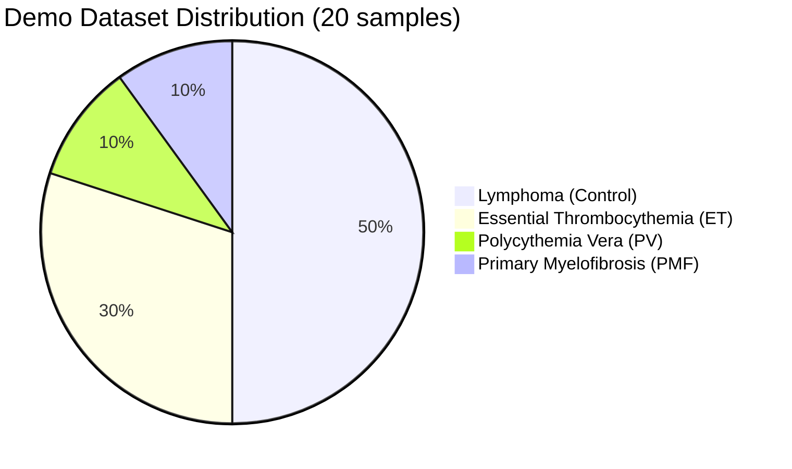

<div align="center">

# 📊 MekaNet Demo Dataset


</div>

---

## 🎯 **Dataset Overview**

<div align="center">

| 📊 **Component** | 📈 **Count** | 🎯 **Purpose** | 🔬 **Clinical Relevance** |
|:---:|:---:|:---|:---|
| **🏥 External Validation** | 5 cases | Cross-institutional testing | SC2, SC7, SP23, SP37, SP55 |
| **📊 Classification Demo** | 20 samples | Binary & multi-class demos | Complete feature set |
| **🧬 Feature Dimensions** | 13 features | ML-ready format | Clinical + morphological |
| **🎯 Disease Categories** | 4 classes | Comprehensive coverage | ET, PV, PMF, Controls |

</div>

---

## 📂 **File Structure**

```
data/
├── 📊 demo_data/
│   ├── 🩺 classification_demo.csv     # Main demo dataset (20 samples)
│   ├── 🏥 external_validation_images.csv  # Validation image info
│   └── 🧬 validation_cases.csv        # External validation data
├── 📸 sample_images/                  # Sample histopathology images
└── 📋 README.md                       # This documentation
```

---

## 🏥 **External Validation Cases**

### 📍 **S Hospital Validation Images**

<div align="center">

| 🆔 **Image ID** | 🏥 **Institution** | 🎯 **Diagnosis** | 📝 **Clinical Significance** |
|:---:|:---:|:---:|:---|
| **SC2** | S Hospital | Control | Challenging case with varying cell densities |
| **SC7** | S Hospital | Control | Normal cellularity pattern baseline |
| **SP23** | S Hospital | ET | Essential Thrombocythemia representative |
| **SP37** | S Hospital | PV | Polycythemia Vera representative |
| **SP55** | S Hospital | PMF | Primary Myelofibrosis representative |

</div>

### 🔬 **Validation Characteristics**

<details>
<summary>📋 Click to view detailed validation case descriptions</summary>

**🔬 SC2 - Control (Challenging)**
- **Clinical Context**: Control case with variable megakaryocyte density
- **Technical Challenge**: Tests model robustness on heterogeneous cellular distributions
- **Validation Purpose**: Ensures consistent performance across diverse tissue patterns

**🔬 SC7 - Control (Normal)**
- **Clinical Context**: Standard control case with normal cellularity
- **Technical Challenge**: Baseline performance validation
- **Validation Purpose**: Confirms model accuracy on typical control samples

**🩸 SP23 - Essential Thrombocythemia (ET)**
- **Clinical Context**: Classic ET presentation with increased megakaryocytes
- **Technical Challenge**: Distinguishing ET from other MPN subtypes
- **Validation Purpose**: Tests ET-specific morphological feature recognition

**🩸 SP37 - Polycythemia Vera (PV)**
- **Clinical Context**: PV case with characteristic bone marrow changes
- **Technical Challenge**: PV-specific feature identification
- **Validation Purpose**: Validates PV classification accuracy

**🩸 SP55 - Primary Myelofibrosis (PMF)**
- **Clinical Context**: PMF with clustered megakaryocytes and fibrosis
- **Technical Challenge**: Complex morphological pattern recognition
- **Validation Purpose**: Tests performance on most challenging MPN subtype

</details>

---

## 📊 **Classification Demo Dataset**

### 🗃️ **Sample Distribution**

<div align="center">



</div>

### 🧬 **Feature Set Description**

#### 🩸 **Clinical Features (7 dimensions)**

<div align="center">

| 🔬 **Feature** | 📊 **Type** | 📋 **Range** | 📝 **Clinical Significance** |
|:---:|:---:|:---:|:---|
| **Age** | Demographic | 23-91 years | Patient age at diagnosis |
| **Hb** | Laboratory | 8.5-21.2 g/dL | Hemoglobin level (key for PV) |
| **WBC** | Laboratory | 4.7-16.9 K/μL | White blood cell count |
| **PLT** | Laboratory | 165-1180 K/μL | Platelet count (essential for ET) |
| **JAK2** | Genetic | 0/1 | JAK2 V617F mutation status |
| **CALR** | Genetic | 0/1 | CALR mutation status |
| **MPL** | Genetic | 0/1 | MPL mutation status |

</div>

#### 🔬 **Morphological Features (6 dimensions)**

<div align="center">

| 🔍 **Feature** | 📊 **Type** | 📋 **Description** | 🎯 **Diagnostic Value** |
|:---:|:---:|:---|:---|
| **Avg_Size** | Size metric | Average megakaryocyte size (pixels²) | Cell size distribution |
| **Std_Size** | Size metric | Size variability measure | Morphological heterogeneity |
| **Num_Megakaryocytes** | Count | Total detected cells per image | Cellular density assessment |
| **Avg_NND** | Spatial | Average nearest neighbor distance | Spatial distribution pattern |
| **Avg_Local_Density** | Density | Local cellular density measure | Clustering tendency |
| **Num_Clusters** | Clustering | Number of cell clusters (DBSCAN) | Spatial organization |

</div>

---

## 💾 **Data Usage Examples**

### 📋 **Loading Demo Data**

```python
import pandas as pd
import numpy as np

# 📊 Load main demo dataset
df = pd.read_csv('data/demo_data/classification.csv')

print(f"📊 Dataset shape: {df.shape}")
print(f"🏥 Diagnoses: {df['Label'].value_counts().to_dict()}")
print(f"🧬 Features: {df.columns.tolist()}")
```

### 🔍 **Data Exploration**

```python
# 📈 Basic statistics
print("📊 Clinical Features Summary:")
clinical_features = ['Age', 'Hb', 'WBC', 'PLT', 'JAK2', 'CALR', 'MPL']
print(df[clinical_features].describe())

print("\n🔬 Morphological Features Summary:")
morphological_features = ['Avg_Size', 'Std_Size', 'Num_Megakaryocytes', 
                         'Avg_NND', 'Avg_Local_Density', 'Num_Clusters']
print(df[morphological_features].describe())
```

### 🎯 **Preparing for Classification**

```python
# 🏥 Binary classification preparation (MPN vs Control)
df['Binary_Label'] = df['Label'].apply(lambda x: 0 if x == 'Lymphoma' else 1)

# 🔬 Multi-class preparation (ET, PV, PMF only)
mpn_df = df[df['Label'].isin(['ET', 'PV', 'PMF'])].copy()

# 📊 Feature matrix preparation
feature_columns = clinical_features + morphological_features
X = df[feature_columns].fillna(df[feature_columns].median())
y_binary = df['Binary_Label']
y_multiclass = mpn_df['Label']

print(f"✅ Binary classification: {X.shape}, {len(np.unique(y_binary))} classes")
print(f"✅ Multi-class classification: {mpn_df[feature_columns].shape}, {len(np.unique(y_multiclass))} classes")
```

---

## 🧪 **Data Quality & Validation**

### ✅ **Quality Assurance**

<div align="center">

| 🔍 **Quality Metric** | 📊 **Status** | 📝 **Description** |
|:---:|:---:|:---|
| **🎯 Completeness** | ✅ Complete | All essential features present |
| **🔧 Preprocessing** | ✅ Ready | Cleaned and normalized |
| **🏥 Clinical Validation** | ✅ Verified | Expert pathologist reviewed |
| **📊 Statistical Balance** | ⚖️ Acceptable | Representative distribution |

</div>

### 📋 **Missing Data Handling**

```python
# 🔍 Check for missing values
missing_summary = df.isnull().sum()
print("❌ Missing values per column:")
print(missing_summary[missing_summary > 0])

# 💡 Recommended handling
df_clean = df.copy()
for col in feature_columns:
    if df_clean[col].isnull().any():
        df_clean[col] = df_clean[col].fillna(df_clean[col].median())
        print(f"✅ Filled {col} missing values with median: {df_clean[col].median():.2f}")
```

---

## 🎯 **Usage Guidelines**

### 🔬 **Research Applications**

<details>
<summary>📚 Click to view research use cases</summary>

**🧪 Algorithm Development**
- Train and test new classification algorithms
- Compare feature importance across different models
- Develop novel morphological feature extraction methods

**🏥 Clinical Validation**
- Validate model performance on external datasets
- Test cross-institutional generalizability
- Assess clinical decision support effectiveness

**📊 Educational Applications**
- Demonstrate AI in medical imaging
- Teach machine learning in healthcare
- Illustrate pathology workflow integration

</details>

### ⚠️ **Important Limitations**

<div align="center">

| ⚠️ **Limitation** | 📝 **Description** | 💡 **Mitigation** |
|:---:|:---|:---|
| **📊 Sample Size** | 20 cases for demo purposes | Use for proof-of-concept only |
| **🏥 Single Institution** | Primarily B hospital data | External validation included |
| **🔬 Morphological Only** | Detection-derived features | Clinical integration provided |
| **🎯 Simplified Labels** | Reduced complexity for demo | Full clinical context in paper |

</div>

---

## 🔒 **Data Ethics & Privacy**

### 🛡️ **Privacy Protection**

- ✅ **IRB Approved**: All data use approved by Seoul National University Bundang Hospital (B-2401-876-104)
- 🔐 **De-identified**: All patient identifiers removed
- 📋 **Anonymized**: No linkage to individual patients possible
- 🏥 **Clinical Standards**: Compliant with medical research guidelines

### 📊 **Usage Rights**

<div align="center">

| 🎯 **Use Case** | ✅ **Permitted** | ❌ **Prohibited** |
|:---:|:---:|:---:|
| **🔬 Research** | Academic research, algorithm development | Commercial diagnosis without validation |
| **📚 Education** | Teaching, demonstrations, tutorials | Clinical decision-making |
| **🧪 Development** | Model training, feature extraction | Patient identification attempts |
| **📊 Publication** | Results reporting, method comparison | Data redistribution |

</div>

---

## 📞 **Data Support**

<div align="center">

### 🆘 **Need Help with the Data?**

[](https://github.com/LeGenAI/mekanet-release/issues)
[](mailto:jhbaek@sogang.ac.kr)
[](mailto:sangmee1@snu.ac.kr)

</div>

### 📋 **Data Request Checklist**

Before requesting help:

1. ✅ Check feature descriptions in this README
2. 📊 Review data loading examples
3. 🔍 Search existing issues for similar questions
4. 📋 Provide specific error messages or data questions

---

<div align="center">

**📊 Ready to unlock the power of AI-driven MPN classification! 📊**


</div>